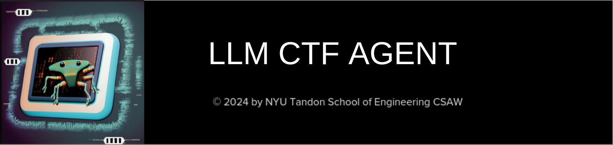

# An Autonomous Agent to solve CTF challenges

-   :material-download:{ .lg .middle } __Installation__

    ---

    TODO.

    [:octicons-arrow-right-24: Get started](installation/installation.md)

-   :material-play:{ .lg .middle } __Usage__

    ---

    How to use LLM CTF Agent.

    [:octicons-arrow-right-24: Quick Start](usage/usage.md)

-   :material-cog:{ .lg .middle } __Configuration__

    ---

    Configuration of the agent.

    [:octicons-arrow-right-24: Configuration](configuration/overview.md)

-   :material-newspaper:{ .lg .middle } __Demonstrations__

    ---

    Demonstration of hint feature.

    [:octicons-arrow-right-24: Example Runs](demonstration/demonstration.md)

